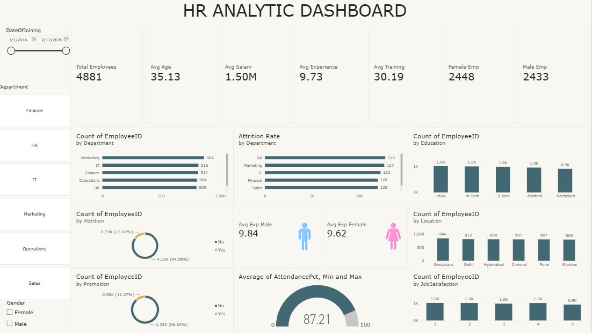

# HR Analytics Dashboard

An interactive Business Intelligence dashboard built to analyze and visualize key HR metrics across an organization of **4,881 employees**. The dashboard consolidates workforce data — demographics, attrition, compensation, education, location, and performance indicators — into a single, filterable view that supports data-driven HR decision-making.

## Overview

The dashboard provides a 360° view of the workforce, combining high-level KPI cards with department-level and category-level breakdowns. It is designed to help HR teams and management quickly identify attrition trends, monitor training and salary metrics, and understand workforce composition by department, education, gender, and location.

## Key Metrics (KPI Cards)

| Metric | Value |
|---|---|
| Total Employees | 4,881 |
| Average Age | 35.13 |
| Average Salary | 1.50M |
| Average Experience | 9.73 years |
| Average Training Hours | 30.19 hrs |
| Female Employees | 2,448 |
| Male Employees | 2,433 |

## Dashboard Components

- **Count of Employee ID by Department** — Horizontal bar chart ranking headcount across Marketing, IT, Finance, Operations, HR, and Sales.
- **Attrition Rate by Department** — Horizontal bar chart showing attrition counts per department, highlighting HR and Marketing as the highest.
- **Count of Employee ID by Attrition** — Donut chart summarizing overall attrition split (15.02% attrited vs. 84.98% retained).
- **Count of Employee ID by Promotion** — Donut chart showing the proportion of employees promoted (11.37%) vs. not promoted (88.63%).
- **Average of AttendancePct (Min/Max)** — Gauge chart displaying average attendance percentage (87.21 out of 100).
- **Avg Experience by Gender** — Side-by-side comparison of average years of experience for male (9.84) and female (9.62) employees.
- **Count of Employee ID by Education** — Column chart segmenting headcount by education level (MBA, M.Tech, B.Tech, Masters, Bachelors).
- **Count of Employee ID by Location** — Column chart showing employee distribution across major cities (Bengaluru, Delhi, Hyderabad, Chennai, Pune, Mumbai).
- **Count of Employee ID by Job Satisfaction** — Column chart displaying employee counts across job satisfaction rating levels (1–5).

## Filters / Slicers

- **Date of Joining** — Date range slider (1/1/2016 – 2/17/2026)
- **Department** — Finance, HR, IT, Marketing, Operations, Sales
- **Gender** — Female, Male

These slicers allow interactive cross-filtering of all visuals based on hire date, department, and gender.

## Dataset

The dashboard is powered by an employee-level dataset (`HR_Analytics_Dataset.csv`) with the following fields:

`EmployeeID`, `Department`, `Gender`, `Age`, `DateOfJoining`, `Salary`, `Experience`, `TrainingHrs`, `Education`, `Location`, `JobSatisfaction`, `Attrition`, `Promotion`, `AttendancePct`

## Tools Used

- **Power BI** — dashboard design, DAX measures, and interactive visuals
- **CSV / Excel** — source data preparation

## Insights

- Attrition sits at roughly **15%** overall, with HR and Marketing showing the highest attrition counts.
- Only **11.37%** of employees have been promoted, suggesting limited internal mobility.
- Average attendance (**87.21%**) indicates generally consistent workforce presence.
- Experience levels are fairly balanced between genders, with male employees averaging slightly higher tenure.

## Author

Add your name, university, and course/project details here (e.g., *Business Information Technology, The University of Jordan*).

## License

Add a license of your choice (e.g., MIT) if this repository is public.
